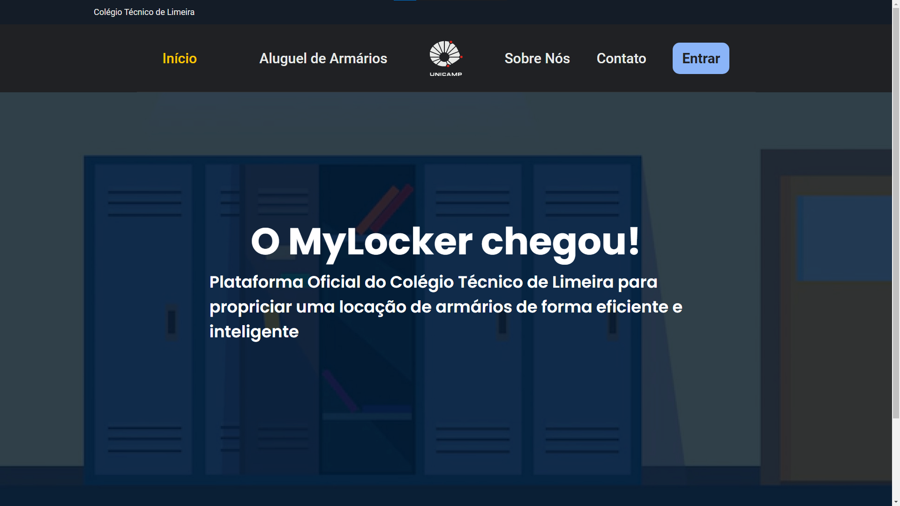
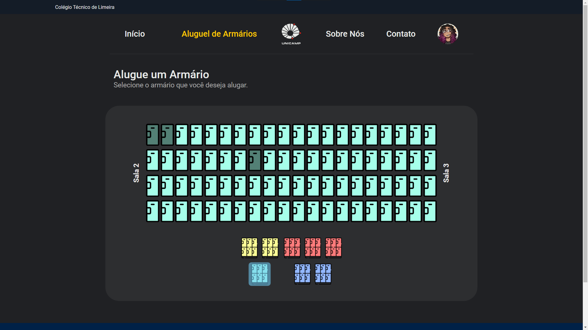

<h1 align='center' background='#002147'>
  
</h1>

<p align="center">
    <a href="https://github.com/tgmarinho/README-ecoleta/commits/master">
    
  </a> <a href="https://github.com/tgmarinho/README-ecoleta/stargazers">
    
  </a> <a href="https://rocketseat.com.br">
    
  </a>
</p>


<h4 align="center">
	🚧  MyLocker 🔒 Concluído 🚀 🚧
</h4>

<h4 align="center">
 <a href="#-sobre-o-projeto">Sobre</a> •
 <a href="#-funcionalidades">Funcionalidades</a> •
 <a href="#-layout">Layout</a> •
 <a href="#-como-executar-o-projeto">Como executar</a> •
 <a href="#-tecnologias">Tecnologias</a> •
 <a href="#-contribuidores">Contribuidores</a> •
 <a href="#-autor">Autor</a> •
 <a href="#user-content--licença">Licença</a>
</h4>

<h3 align='center'>
  <a href="https://mylocker.vercel.app/">Acessar a demonstração</a>
</h3>

<br>

---

<br>


## 📋 Sobre

O projeto **MyLocker** é uma plataforma de locação de armários desenvolvido para o **Colégio Técnico de Limeira**, sendo este nosso projeto de TCC.

## 💻 Sobre o projeto

♻️ Ecoleta - é uma forma de conectar empresas e entidades de coleta de resíduos orgânicos e inorgânicos as pessoas que precisam descartar seus resíduos de maneira ecológica.


Projeto desenvolvido durante a **NLW - Next Level Week** oferecida pela [Rocketseat](https://blog.rocketseat.com.br/primeira-next-level-week/).
O NLW é uma experiência online com muito conteúdo prático, desafios e hacks onde o conteúdo fica disponível durante uma semana.

---

## ⚙️ Funcionalidades

- [x] Empresas ou entidades podem se cadastrar na plataforma web enviando:
  - [x] uma imagem do ponto de coleta
  - [x] nome da entidade, email e whatsapp
  - [x] e o endereço para que ele possa aparecer no mapa
  - [x] além de selecionar um ou mais ítens de coleta:
    - lâmpadas
    - pilhas e baterias
    - papéis e papelão
    - resíduos eletrônicos
    - resíduos orgânicos
    - óleo de cozinha

- [x] Os usuários tem acesso ao aplicativo móvel, onde podem:
  - [x] navegar pelo mapa para ver as instituições cadastradas
  - [x] entrar em contato com a entidade através do E-mail ou do WhatsApp

---

## 🎨 Layout

O layout da aplicação está disponível no Figma:

<a href="https://www.figma.com/file/1SxgOMojOB2zYT0Mdk28lB/Ecoleta?node-id=136%3A546">
  
</a>

<p align="center" style="display: flex; align-items: flex-start; justify-content: center;">
  
</p>

---

## 🚀 Como executar o projeto

Este projeto é divido em três partes:
1. Backend (pasta server)
2. Frontend (pasta web)
3. Mobile (pasta mobile)

💡Tanto o Frontend quanto o Mobile precisam que o Backend esteja sendo executado para funcionar.

### Pré-requisitos

Antes de começar, você vai precisar ter instalado em sua máquina as seguintes ferramentas:
[Git](https://git-scm.com), [Node.js](https://nodejs.org/en/).
Além disto é bom ter um editor para trabalhar com o código como [VSCode](https://code.visualstudio.com/)

#### 🎲 Rodando o Backend (servidor)

```bash
# Clone este repositório
$ git clone git@github.com:tgmarinho/README-ecoleta.git
# Acesse a pasta do projeto no terminal/cmd
$ cd README-ecoleta
# Vá para a pasta server
$ cd server
# Instale as dependências
$ npm install
# Execute a aplicação em modo de desenvolvimento
$ npm run dev:server
# O servidor inciará na porta:3333 - acesse http://localhost:3333
```
<p align="center">
  <a href="https://github.com/tgmarinho/README-ecoleta/blob/master/Insomnia_API_Ecoletajson.json" target="_blank"></a>
</p>


#### 🧭 Rodando a aplicação web (Frontend)

```bash
# Clone este repositório
$ git clone git@github.com:tgmarinho/README-ecoleta.git
# Acesse a pasta do projeto no seu terminal/cmd
$ cd README-ecoleta
# Vá para a pasta da aplicação Front End
$ cd web
# Instale as dependências
$ npm install
# Execute a aplicação em modo de desenvolvimento
$ npm run start
# A aplicação será aberta na porta:3000 - acesse http://localhost:3000
```


---
Desenvolvido 🖤 por
  [Enzo Arilla Torresendi](https://github.com/Enzo-Arilla),
  [Fábio Henrique Benedicto](https://github.com/FabioBenedicto),
  [Pedro Losso Quintans](https://github.com/pQuintans),
  [Pedro Ricieri Marchi](https://github.com/P3d11) e
  [Vinicius Gabriel Laureano](https://github.com/ViniciusLaureano)
